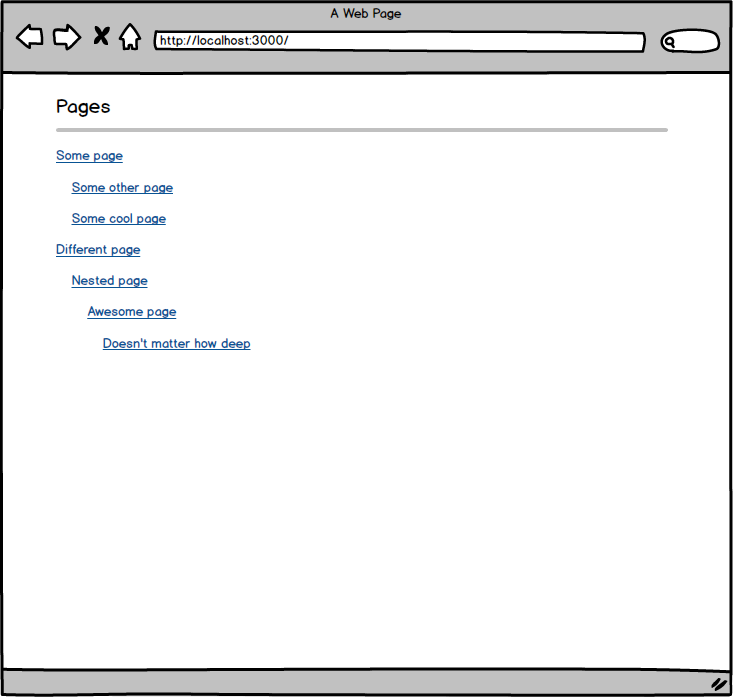
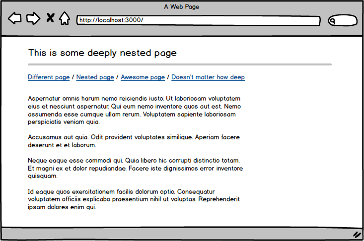
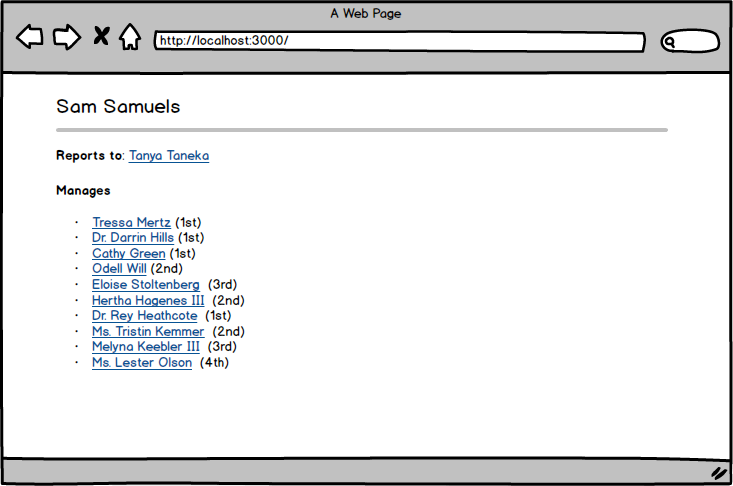

## Trees in real apps

Use this app as an opportunity to practice writing tree-traversal algorithms with ActiveRecord objects.

## Setup

* Run `bin/setup`
* Run `rails s`

## Challenge #1 - Page Tree View

Make the `pages#index` view show a nested list of page, by changing the `page_list` method in `app/helpers/pages_helper.rb`.

## Challenge #2 - Page Breadcrumbs

Add breadcrumbs to the `pages#show` view that show all the parent pages, by changing the `page_breadcrumbs` method in  `app/helpers/pages_helper.rb`.

## Challenge #2 - User show

Write a method that can generate the list of a user's subordinates (throughout the entire tree) along with their levels.

Write this method in the user's model.  Bonus points if you add a model spec.

## Bonus

* Add a `salary` column to users
* Add a method to user that calculates the total salaries for all of the user's subordinates
* Show that on the user's homepage
